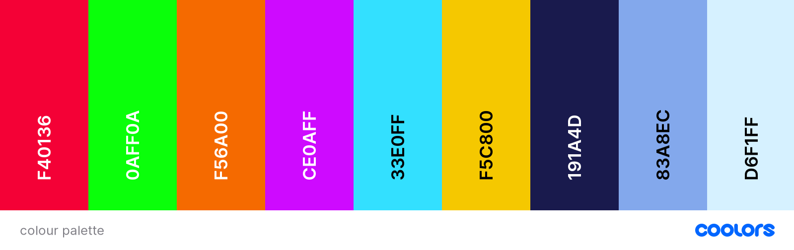

# Block Puzzle

Block puzzle is a geometric tile-matching game based on Tetris. This project is the second milestone project as part of the Code Institute Diploma course. The deployed site can be viewed [here](https://tealhorizon87.github.io/ms2_block-puzzle/)

## Table of Contents
1. [UX](#ux)
    - [User Stories](#user-stories)
    - [Design](#design)
    - [Wireframes](#wireframes)
2. [Features](#features)
3. [Technologies Used](#technologies-used)
4. [Testing](#testing)
5. [Deployment](#deployment)
6. [Credits](#credits)
    - [Content](#content)
    - [Acknowledgements](#acknowledgements)

## UX
This is a web-based game made with HTML and CSS, and animated and controlled using JavaScript. The game is inspired by the ever popular Tetris game and follows similar rules and gameplay.

### User Stories

- As a user, I want -
  - to be told how to play the game before it starts
  - to be able to start and pause the game whenever I want
  - to be able to restart the game if I lose
  - to see my current score and level
  - to see my previous scores, and what my highest score is
  - to be able to play the game on any sized device
  - contact the owner of the game app to suggest additional features or report bugs

### Design

The game is contained on a single web-page. The layout of the page is clean and efficient, with controls and other content such as the rules, current score and level displayed alongside. In order to maintain a clean design, some of these additional items are contained in overlays, accessed through controls on the main page.

The font families used are Aldrich for all headings, and Geo for main body text. Both fonts have been sourced from [Google Fonts](https://fonts.google.com/).

The colours used for the background, text and blocks have been adapted from the current technicolour versions of Tetris, which should give an implied familiarity to the user. The palette was generated by [coolors](https://coolors.co/) and are as follows:

### Wireframes
Below are the wireframes for large, medium and small sized screens. There were created using [Balsamiq](https://balsamiq.com/)
#### Large

#### Medium

#### Small

Back to [Table of Contents](#table-of-contents)

## Features
- A central grid is used as the main game space
- A smaller grid is used to allow the user to see what shape is coming up next
- A readout of the current level and score is displayed so the user can track their progress
- A scoreboard is available that will store the best 10 scores the user has had
- Where there is not enough space to display normally (eg. on a 'small' screen), modals are used
- A contact form will be available to allow user-owner communication

## Technologies Used
### Languages:
  - [HTML5](https://en.wikipedia.org/wiki/HTML5)
    - This is the main mark-up language for the project
  - [CSS3](https://en.wikipedia.org/wiki/CSS)
    - Used for personalised styling over and above the Bootstrap framework
  - [JavaScript](https://en.wikipedia.org/wiki/JavaScript)
    - Used to animate, control and generally run all aspects of the game, scoreboard, and email service for the contact form

### Libraries and Frameworks:
  - [Google Fonts](https://fonts.google.com/)
    - Used as the source for the font databases used in this site
  - [Font Awesome 5.15.3](https://fontawesome.com/)
    - Used as the source for the icons used, including the social media links in the footer

### Tools:
  - [Atom](https://atom.io/) with [GitHub Desktop](https://desktop.github.com/)
    - Atom is my preferred text editor, linked with GitHub Desktop in order to push the code to GitHub
  - [Git](https://git-scm.com/)
    - Used for version control
  - [GitHub](https://github.com/)
    - Used to store, host and publish the project files
  - [Balsamiq](https://balsamiq.com/)
    - A wireframe program used to create the mock-ups
  - [Coolors](https://coolors.co/)
    - An online tool to create colour palettes

Back to [Table of Contents](#table-of-contents)

## Testing

I have gathered all my testing data, and stored it in a seperate file, which acn be found [here](TESTING.md)

## Deployment
### GitHub Pages
Deployment for this project is via GitHub Pages.
1. From the repository home page, select the 'settings' tab
2. Scroll down the menu on the left and select 'pages'
3. From the dropdown menu under 'source', select the branch that you wish to publish (usually master or main)
4. Make sure that the root folder is selected and click save
5. A URL will then be displayed for the project that you can copy into other locations, or just follow to the live page.

Bear in mind that it takes up to 10 minutes for the build process so the page may not be available straight away.

### Forking the Repository
If you would like to view/change the code for the project then you can copy this repository to your GitHub account by forking it. You will then be able to do this without affecting the original repository:
1. From the repository home page,  click the 'fork' button (just below your picture with the dropdown menu)
2. You should now have a copy of the repository on your account

### Making a Local Clone
1. From the repository home page, select the 'code' tab (next to the green 'Gitpod' button)
2. To clone the repository using HTTPS, under "Clone with HTTPS", copy the link.
3. Open Git Bash
4. Change the current working directory to the location where you want the cloned directory to be made.
5. Type 'git clone', and then paste the URL you copied in Step 2.
6. Press Enter. Your local clone will be created.
7. Alternatively, you can use 'Open with GitHub Desktop' and follow the instructions, or just download the ZIP file containing the code files

Click [Here](https://docs.github.com/en/github/creating-cloning-and-archiving-repositories/cloning-a-repository-from-github/cloning-a-repository#cloning-a-repository-to-github-desktop) to view the GitHub documentation on deployment for further help and advice.

Back to [Table of Contents](#table-of-contents)

## Credits

### Content
  - The CSS reset page was taken from [here](https://meyerweb.com/eric/tools/css/reset/)
  - All other code was written by myself, but with inspiration taken from the following sources:
    - [kubowania](https://github.com/kubowania/Tetris-Basic) via the associated [YouTube](https://www.youtube.com/watch?v=rAUn1Lom6dw&list=WL&index=4) video - this provided the basic structural inspiration for the code
    - [jamesqquick](https://github.com/jamesqquick/Build-A-Quiz-App-With-HTML-CSS-and-JavaScript) and the associated [YouTube](https://www.youtube.com/watch?v=DFhmNLKwwGw&list=WL&index=6&t=459s) to help understand how to set up the local storage code

### Acknowledgements
  - Thanks to my mentor for help, guidance and support during this project as always
  - [MDN Web Docs](https://developer.mozilla.org/en-US/) - an essential source of support for any developer.
  - [Stack Overflow](https://stackoverflow.com/) - much like w3schools, an essential source of guidance...there is always someone who has had the same problem, and the answer is likely here.
  - [Code Institute](https://codeinstitute.net/) - from inspiration through all the walkthrough projects to the tools needed to complete.

Back to [Table of Contents](#table-of-contents)
