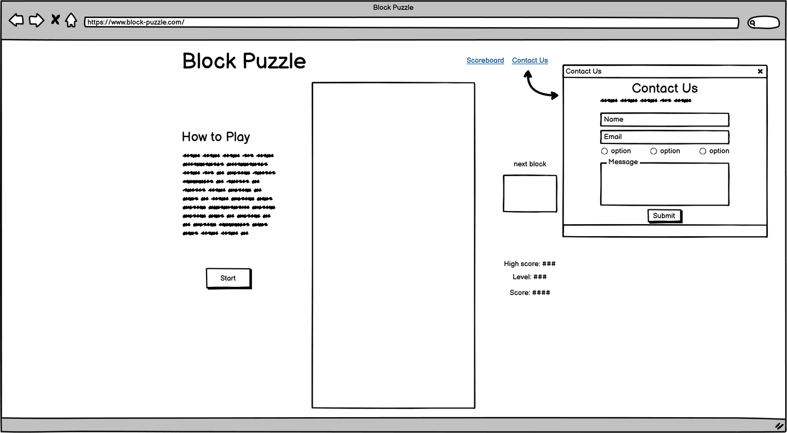

# Block Puzzle

Block puzzle is a geometric tile-matching game based on Tetris. This project is the second milestone project as part of the Code Institute Diploma course.

## Table of Contents
1. [UX](#ux)
    - [User Stories](#user-stories)
    - [Design](#design)
    - [Wireframes](#wireframes)
2. [Features](#features)
3. [Technologies Used](#technologies-used)
4. [Testing](#testing)
5. [Deployment](#deployment)
6. [Credits](#credits)
    - [Content](#content)
    - [Media](#media)
    - [Acknowledgements](#acknowledgements)

## UX
This is a web-based game made with HTML and CSS, and animated and controlled using JavaScript. The game is inspired by the ever popular Tetris game and follows similar rules and gameplay.

### User Stories

- As a user, I want -
  - to be told how to play the game before it starts
  - to be able to start and pause the game whenever I want
  - to be able to restart the game if I lose
  - to see my current score and level
  - to see my previous scores, and what my highest score is
  - to be able to play the game on any sized device
  - contact the owner of the game app to suggest additional features or report bugs

### Design

The game is contained on a single web-page. The layout of the page is clean and efficient, with controls and other content such as the rules, current score and level displayed alongside. In order to maintain a clean design, some of these additional items are contained in overlays, accessed through controls on the main page.

The font families used are Aldrich for all headings, and Geo for main body text. Both fonts have been sourced from [Google Fonts](https://fonts.google.com/).

The colours used for the background, text and blocks have been adapted from the current technicolour versions of Tetris, which should give an implied familiarity to the user. The palette was generated by [coolors](https://coolors.co/) and are as follows:

### Wireframes
Below are the wireframes for large, medium and small sized screens. There were created using [Balsamiq](https://balsamiq.com/)
#### Large

#### Medium

#### Small

## Features
- A central grid is used as the main game space
- A smaller grid is used to allow the user to see what shape is coming up next
- A readout of the current level and score is displayed so the user can track their progress
- A scoreboard is available that will store the best 10 scores the user has had
- Where there is not enough space to display normally (eg. on a 'small' screen), modals are used
- A contact form will be available to allow user-owner communication

## Technologies Used
### Languages:
  - [HTML5](https://en.wikipedia.org/wiki/HTML5)
    - This is the main mark-up language for the project
  - [CSS3](https://en.wikipedia.org/wiki/CSS)
    - Used for personalised styling over and above the Bootstrap framework
  - [JavaScript](https://en.wikipedia.org/wiki/JavaScript)
    - Used to animate, control and generally run all aspects of the game, scoreboard, and email service for the contact form

### Libraries and Frameworks:
  - [Google Fonts](https://fonts.google.com/)
    - Used as the source for the font databases used in this site
  - [Font Awesome 5.15.3](https://fontawesome.com/)
    - Used as the source for the icons used, including the social media links in the footer

### Tools:
  - [Atom](https://atom.io/) with [GitHub Desktop](https://desktop.github.com/)
    - Atom is my preferred text editor, linked with GitHub Desktop in order to push the code to GitHub
  - [Git](https://git-scm.com/)
    - Used for version control
  - [GitHub](https://github.com/)
    - Used to store, host and publish the project files
  - [Balsamiq](https://balsamiq.com/)
    - A wireframe program used to create the mock-ups
  - [Coolors](https://coolors.co/)
    - An online tool to create colour palettes

## Testing

## Deployment

## Credits

### Content
### Media
### Acknowledgements
