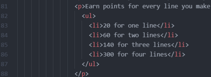
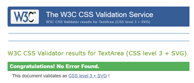
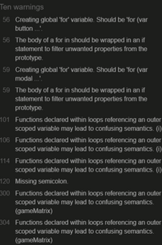
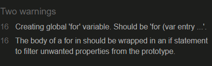
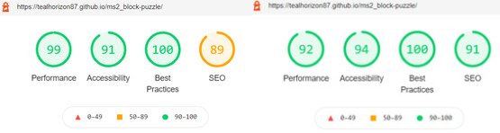
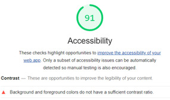
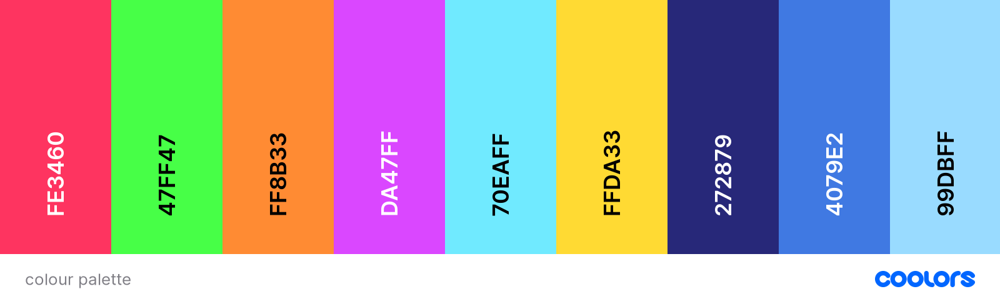
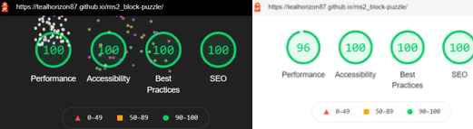
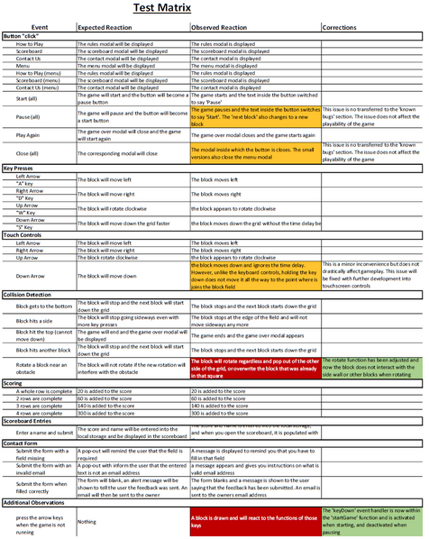

# Testing

This page contains all the stages that I went through to test this page and it's features.

## Table of Contents
1. [Code Validation](#code-validation)
    - [HTML](#html)
    - [CSS](#css)
    - [JavaScript](#javascript)
2. [Responsiveness](#responsiveness)
3. [Performance](#performance)
4. [Objective Testing](#objective-testing)
5. [User Story Evaluation](#user-story-evaluation)

## Code Validation

### HTML
The HTML code was passed through the [W3C Markup Validation Service](https://validator.w3.org/). On the initial validation there were several warnings and cautions.
  - There were several elements with unnecessary attributes that were deleted, and some with the wrong values that were corrected. These corrections were made in commit [#5dca200](https://github.com/tealhorizon87/ms2_block-puzzle/commit/5dca200fde38a5695df3e1b1e9fafba7ed9c5569).
  - There remains 3 warnings regarding headings for the 3 sections used for the main part of the page, and a warning regarding a paragraph closing tag without and opening tag. This is a spurious warning and has been disregarded (see picture below).

  
  

### CSS
The CSS file was passed through the [W3C CSS Validation Service](https://jigsaw.w3.org/css-validator/). The file passed with no comments.

### JavaScript
The JavaScript files were copied into [JSHint](https://jshint.com/) for error checking. The first pass revealed that there were a lot of missing semicolons or semicolons in the wrong place. After reviewing how semicolons should be used I corrected the whole file and passed it through [JSHint](https://jshint.com/) again. This now came out with 10 warnings that relate to functions within functions or global FOR loops.

The warnings are valid but in the context of this project I have chosen to ignore them as the code works fine without correcting them.

## Responsiveness

This game has been designed as a web-based game to be played primarily on a desktop or laptop computer with the use of a keyboard. The page is however, fully responsive and - within reason - will display the essential components of the page for all screen sizes. Control buttons that emulate the keyboard buttons have been added below the game grid so that users with touch screens can play the game.

All buttons, forms and menu icons work with touch screens.

Further development is required to make this game fully touch screen responsive and to lock the page orientation for tablets.

## Performance

### Lighthouse
Lighthouse was used to assess the performance of the page. This was done for both desktop and mobile versions; the reports are shown here (desktop/mobile):

The desktop report showed 2 issues. In the 'SEO' section it stated that there was no meta description, and - as shown below - the 'accessibility' section stated that the contrast between colours was not strong enough.

A new colour palette was made and installed to the page. Below are the two palettes for comparison.

The colour palette was added in commit [#4044ca7](https://github.com/tealhorizon87/ms2_block-puzzle/commit/4044ca74022b2fb1b9fe3ce79906ba6b46c63448) and the meta description in commit [#fe4b03d](https://github.com/tealhorizon87/ms2_block-puzzle/commit/fe4b03d64ac658a54ff58940b7ea0968c9760d0b). After these adjustments lighthouse was run again, and the reports are shown below:

## Objective Testing

Below is a preview of the table containing the testing matrix that was used to make sure all the functions in the project work correctly:

The full table can be found [here](assets/docs/test-matrix-complete.pdf). The corrections that were made are contained within commit [#34cfe3d](https://github.com/tealhorizon87/ms2_block-puzzle/commit/34cfe3d0acd86a50f46b24abf477e0812fd9d92b).

## User Story Evaluation

Finally, to make sure that the goals set out at the beginning of the project have been met, the user stories were evaluated:

- As a user, I want -
  - to be told how to play the game before it starts
    - __This was to be achieved by having the rules displayed on the page at all times, but style-wise it didn't work. the rules are now found in the 'How to Play' menu option, which should be easy enough for any user to find__
  - to be able to start and pause the game whenever I want
    - __A start button is always visible on all screen sizes, and when clicked to start the game, becomes the pause button__
  - to be able to restart the game if I lose
    - __a 'Play Again' button is in the game over screen that will allow the user to start the game again without further navigation__
  - to see my current score and level
    - __This is achieved in the readout to the right of the main grid. This is currently not available on small screens and will be added at a later date. There are also no levels associated with the game any more__
  - to see my previous scores, and what my highest score is
    - __The scoreboard screen will display the users best 10 scores, and the 'high score' readout to the right of the main grid achieves this__
  - to be able to play the game on any sized device
    - __As described before, the user is able to play the game on any sized screen. There are some features that are currently unavailable on the smallest screen sizes due to screen space. These may be added at a later stage__
  - contact the owner of the game app to suggest additional features or report bugs
    - __A contact form is available on the contact screen so the user can contact the owner__
